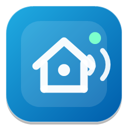
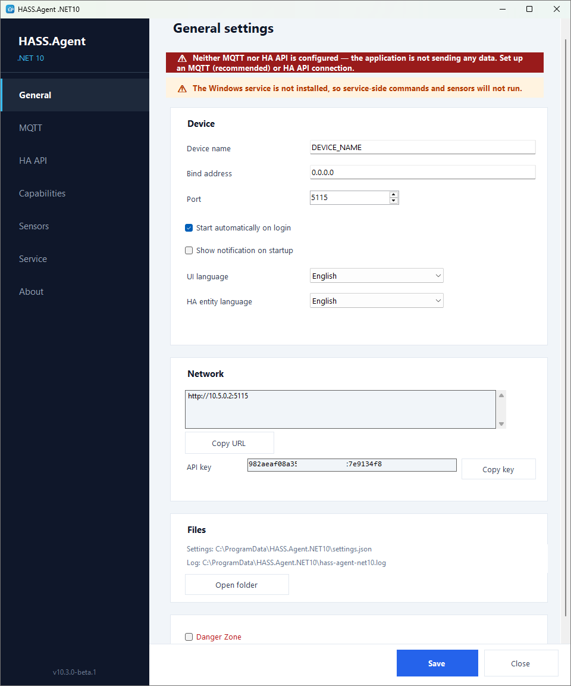
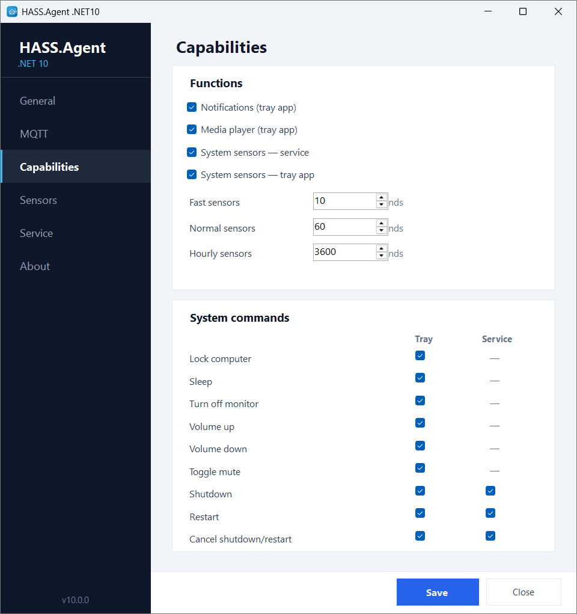
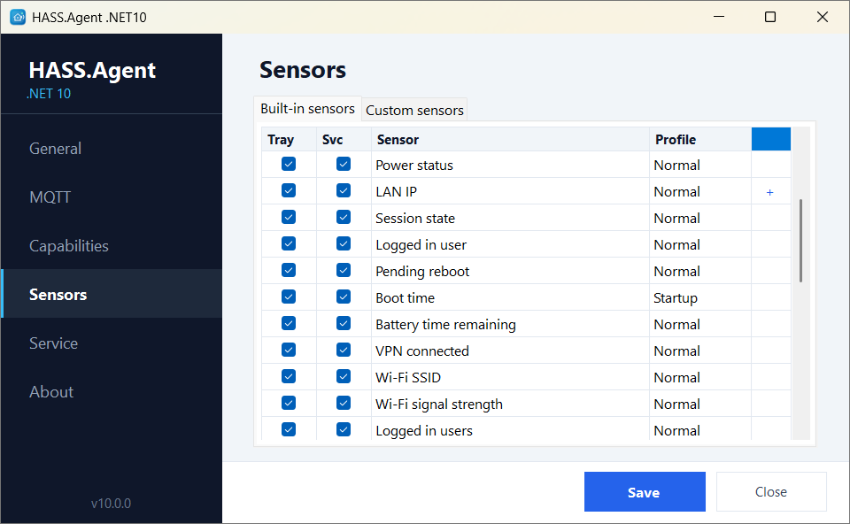
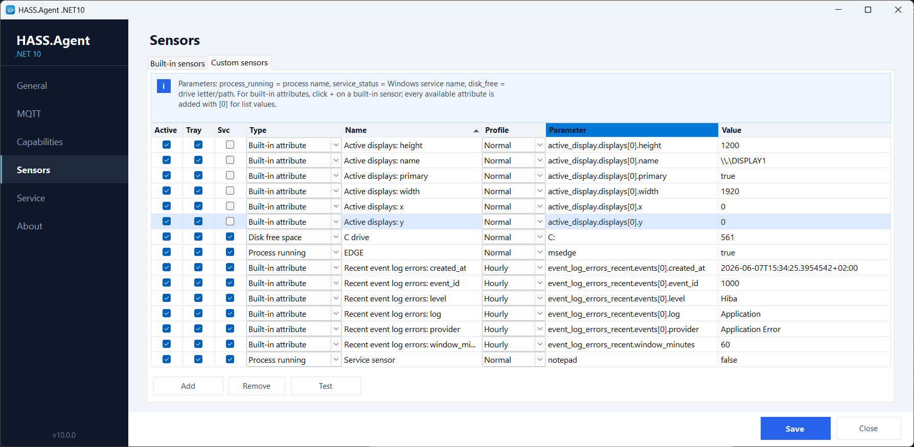

# HASS.Agent .NET10




A modern Windows companion app for Home Assistant.

This fork refreshes the classic HASS.Agent idea into **HASS.Agent .NET10**, a lightweight .NET 10 client built for current Windows desktops. The original client was a .NET 6-era application; this version focuses on a smaller, cleaner runtime, Home Assistant integration via MQTT or WebSocket API, Windows 11-friendly UX, and a split tray app/system service model.

It is designed for Windows PCs you want to observe and control from Home Assistant: media playback, notifications, sensors, shutdown/restart, command buttons, and rich machine state.

The modern .NET10 line starts at **version 10.0.0**. The pre-.NET10 client remains available on the `legacy` branch for users who do not want to migrate yet.

---

## Table of Contents

- [What Changed](#what-changed)
- [Requirements](#requirements)
- [Quick Start](#quick-start)
- [Features](#features)
  - [Notifications](#notifications)
  - [Media Player](#media-player)
  - [System Commands](#system-commands)
  - [Windows Service](#windows-service)
  - [Danger Zone](#danger-zone)
- [Sensors](#sensors)
  - [Built-in Sensors](#built-in-sensors)
  - [Sensor Attributes](#sensor-attributes)
  - [Sensor Polling Profiles](#sensor-polling-profiles)
  - [Custom Sensors](#custom-sensors)
- [Home Assistant Integration](#home-assistant-integration)
  - [Connection Modes](#connection-modes)
  - [MQTT Topics](#mqtt-topics)
  - [HA API WebSocket Events](#ha-api-websocket-events)
- [Local HTTP API](#local-http-api)
- [Installer](#installer)
- [Build from Source](#build-from-source)
- [Windows Firewall](#windows-firewall)
- [Minimal Development Setup](#minimal-development-setup)

---

## What Changed

### 10.3.0

- Added one-click updates from Home Assistant: the update entity's **Install** button downloads and installs the new version on the PC — fully silent when the system service is installed, with a UAC prompt otherwise.
- Added persistent notifications to Home Assistant for update progress: started, completed (with version), no installer, or failure.
- Added the opt-in **Danger Zone** tab: maintenance and diagnostics tools behind a checkbox on the General page.
- Added MQTT maintenance: list and delete retained HASS.Agent messages on the broker (per device or all devices).
- Added one-click discovery republish on the active connection (MQTT or HA API).
- Added a live debug log viewer with filtering and a runtime verbose (DEBUG) logging toggle.
- Added a live MQTT monitor for the `hass.agent/#` topics with payload preview.
- Added settings backup/restore to a portable JSON file (machine-bound secrets excluded).
- Added factory reset with double confirmation and automatic app restart.
- Added a beta update channel: opt in to receive GitHub pre-releases from the update checker.
- Pre-release versions (`10.3.0-beta.1`) are now handled correctly by the version comparison and shown in the UI.

### 10.2.0

- Fixed default language set to Hungarian on non-Hungarian systems; the app now auto-detects the OS language and defaults to English.
- Fixed clean install not removing legacy `HASS.Agent.Companion` directories, causing old settings to migrate back.
- Fixed tray icon missing in standalone single-file publish by embedding the icon as an assembly resource.
- Removed the "MQTT not configured" warning from the General page when HA API is enabled.

### 10.1.0

- Added Home Assistant WebSocket API transport for MQTT failover and MQTT-free remote control.
- Added HA API settings, connection testing, HTTP warning tooltip, and setup status banners.
- Added HA API cross-check for the installed HASS.Agent Home Assistant integration version.
- Added Home Assistant update entity publishing and About-page update checks.
- Added multi-value built-in sensor attributes and one-click custom sensor generation.
- Added per-sensor polling profiles: fast, normal, hourly, and startup.
- Added custom sensor value testing without blocking the settings UI.
- Improved Windows Update pending detection and release lookup.
- Improved service/MQTT setup warnings, About page actions, and tray service labeling.
- Switched MQTT topic routing and HA API command targeting to `serial_number` so device renames do not break commands.

### 10.0.0

- Rebuilt the companion client as a modern `.NET 10` Windows app.
- Added a Windows tray app for interactive user-session features.
- Added a Windows service for system-level features that should work without a logged-in user.
- Renamed the modern client to **HASS.Agent .NET10** so it is clearly separate from the legacy app.
- Moved shared settings/logs to `C:\ProgramData\HASS.Agent.NET10`.
- Added MQTT discovery and dynamic Home Assistant entities.
- Added a role matrix so features can be handled by `Service`, `Tray app`, or both.
- Added a configurable sensor catalog and custom sensors.
- Added service-aware shutdown/restart/restart-cancel support.
- Added a new Windows 11-style icon.

## Requirements

- Windows 10 version 2004 / build 19041 or newer
- Windows 11 recommended
- x64 Windows
- Home Assistant with **MQTT broker** (recommended, e.g. Mosquitto) **or HA API** (WebSocket, e.g. via Nabu Casa)
- The companion Home Assistant integration:
  [v1k70rk4/HASS.Agent.NET10-Integration](https://github.com/v1k70rk4/HASS.Agent.NET10-Integration)

Windows versions older than Windows 10 2004 are intentionally blocked. The app targets `net10.0-windows10.0.19041.0` and uses modern Windows APIs for notifications, media sessions, services, sensors, and desktop state.

If you download a published self-contained build, you do **not** need to install the .NET runtime separately. If you want to build from source, install the **.NET 10 SDK**.

## Quick Start

1. Install the Home Assistant integration:
   [v1k70rk4/HASS.Agent.NET10-Integration](https://github.com/v1k70rk4/HASS.Agent.NET10-Integration)
2. Download a release build or the installer from [Releases](https://github.com/v1k70rk4/HASS.Agent/releases), or build from source.
3. Run the installer or start `HASS.Agent.NET10.exe` directly.
4. Open the tray icon and go to settings.
5. On the **MQTT** page, enable MQTT and enter your broker address and credentials.
   Alternatively, on the **HA API** page, enable the WebSocket connection to Home Assistant (useful for remote access via Nabu Casa or when no MQTT broker is available).
6. On the **Capabilities** page, choose which features are handled by the tray app vs. the service.
7. On the **Sensors** page, enable built-in sensors and add custom sensors.
8. Optionally install the Windows service from the **Service** page.
9. The device appears automatically in Home Assistant.

<p align="center"></p>

---

## Features

### Notifications

Receive Home Assistant notifications on Windows as tray balloon tips or actionable popup windows.

Supports actionable notifications: buttons in the popup can publish an action event back to Home Assistant, so automations can react to user choices.

```yaml
action: hass_agent.send_notification
target:
  entity_id: notify.my_pc_notifications
data:
  title: Home Assistant
  message: "Would you like to turn on the lights?"
  data:
    actions:
      - action: lights_on
        title: "Turn on"
      - action: lights_off
        title: "Turn off"
```

Button presses are published to MQTT and appear as an event entity in Home Assistant.

### Media Player

Expose the active Windows media session to Home Assistant as a `media_player` entity:

- current title, artist, album
- play / pause / stop
- next / previous track
- seek
- volume and mute control
- TTS playback (Home Assistant TTS engine generates audio URL, agent plays it)

The media player uses Windows global media transport sessions for playback control and the default Windows audio endpoint for volume/mute.

### System Commands

Control the PC from Home Assistant via button entities or service calls:

| Command | Description | Service capable |
|---------|------------|:-:|
| `lock` | Lock workstation | |
| `sleep` | Suspend | |
| `monitor_off` | Turn off monitors | |
| `volume_up` | Volume +5% | |
| `volume_down` | Volume -5% | |
| `toggle_mute` | Toggle mute | |
| `shutdown` | Shutdown (with delay) | yes |
| `restart` | Restart (with delay) | yes |
| `restart_cancel` | Cancel pending shutdown/restart | yes |

Shutdown and restart support configurable delay, force mode, and translated comments:

```yaml
action: hass_agent.execute_command
data:
  device_name: MY-PC
  command: restart
  force: true
  time: 30
  comment: "Restarted from Home Assistant"
```

### Windows Service

The same executable can run as a tray app or as a Windows service. Use the **Service** page to install, start, stop, or uninstall the service (UAC elevation is requested automatically).

**Service** handles features that should work even when nobody is logged in:
- shutdown, restart, restart_cancel
- system sensors (CPU, memory, disk, network, etc.)
- custom sensors (process, service, disk)

**Tray app** handles interactive user-session features:
- notifications
- media player
- active window/process sensors
- clipboard, audio, monitor state
- user session details

Use the **Capabilities** page to choose which role handles each feature.

<p align="center"></p>

### Danger Zone

An opt-in maintenance and diagnostics toolbox. Enable it with the **Danger Zone** checkbox on the General page and a new tab appears with the following tools:

| Tool | What it does |
|------|--------------|
| **MQTT maintenance** | Lists every retained HASS.Agent message on the broker (this device's or all devices') and deletes the selected ones — the cure for ghost entities after renames or reinstalls. |
| **Republish discovery** | Re-sends the device discovery on the active connection (MQTT or HA API) without restarting the app. |
| **Debug log** | Live log viewer with filtering, plus a verbose toggle that enables DEBUG-level logging (including every sent/received MQTT message) until the next restart. |
| **Live MQTT monitor** | Watches the `hass.agent/#` topics in real time with a payload preview — see exactly what the agent sends and receives. |
| **Backup / restore** | Exports the settings to a portable JSON file and restores them from one. DPAPI-protected secrets (MQTT password, HA API token) are machine-bound and excluded. |
| **Factory reset** | Deletes all settings after a double confirmation and restarts the app with a fresh serial number and API key. |

The Danger Zone also hosts the **beta updates** toggle: when enabled, update checks include GitHub pre-releases, so you can follow the beta channel. Stable users are never offered pre-releases.

---

## Sensors

### Built-in Sensors

The **Sensors** page has two tabs: **Built-in sensors** and **Custom sensors**.

Built-in sensors are predefined system metrics. Each one can be enabled/disabled independently and assigned to the tray app, the service, or both:

| Sensor | Profile | Service | Tray |
|--------|---------|:---:|:---:|
| CPU usage | fast | yes | yes |
| Memory usage | fast | yes | yes |
| Available memory (MB) | fast | yes | yes |
| System drive free % | normal | yes | yes |
| System drive free (GB) | normal | yes | yes |
| Uptime | fast | yes | yes |
| Boot time | startup | yes | yes |
| Battery level | normal | yes | yes |
| Battery time remaining | normal | yes | yes |
| Power status | normal | yes | yes |
| LAN IP | normal | yes | yes |
| Session state | normal | yes | yes |
| Logged in user | normal | yes | yes |
| Logged in users (count) | normal | yes | yes |
| RDP sessions | normal | yes | yes |
| Pending reboot | normal | yes | yes |
| VPN connected | normal | yes | yes |
| Wi-Fi SSID | normal | yes | yes |
| Wi-Fi signal | normal | yes | yes |
| Bluetooth enabled | hourly | yes | yes |
| Windows Update pending | hourly | yes | yes |
| Recent Event Log errors | hourly | yes | yes |
| Last shutdown reason | startup | yes | yes |
| Active window | fast | | yes |
| Active process | fast | | yes |
| Foreground app & window | fast | | yes |
| Volume | fast | | yes |
| Muted | fast | | yes |
| Monitor power state | normal | | yes |
| Active displays | normal | | yes |
| Idle time | fast | | yes |
| Session locked | fast | | yes |
| User present | fast | | yes |
| Clipboard text available | fast | | yes |
| Audio output device | normal | | yes |
| Microphone muted | normal | | yes |

<p align="center"></p>

### Sensor Attributes

Some sensors have a simple primary state but expose richer details as attributes. These attributes can be extracted into separate Home Assistant entities using the `built_in_attribute` custom sensor type (see [Custom Sensors](#custom-sensors)).

Sensors with attributes:

| Sensor | Attributes |
|--------|-----------|
| **LAN IP** | `addresses[N].adapter`, `addresses[N].description`, `addresses[N].address` |
| **Active displays** | `displays[N].name`, `displays[N].primary`, `displays[N].width`, `displays[N].height`, `displays[N].x`, `displays[N].y` |
| **Recent Event Log errors** | `window_minutes`, `events[N].log`, `events[N].provider`, `events[N].event_id`, `events[N].level`, `events[N].created_at` |
| **Last shutdown reason** | `reason`, `event_id`, `created_at`, `message` |

### Sensor Polling Profiles

Sensors are refreshed by profile instead of one global interval. Each profile interval is configurable in the app:

| Profile | Default | Description |
|---------|---------|-------------|
| **fast** | 10 sec | CPU, memory, active window, volume, etc. |
| **normal** | 60 sec | Disk, battery, network, session state, etc. |
| **hourly** | 3600 sec | Bluetooth, Windows Update, Event Log, etc. |
| **startup** | once | Boot time, last shutdown reason |

Minimum interval is 10 seconds for all profiles.

### Custom Sensors

Custom sensors are parameterized sensors you can add multiple times with different settings. Each custom sensor has:

- **Type** - what kind of sensor it is
- **Name** - the entity name in Home Assistant
- **Parameter** - what to monitor (depends on type)
- **Profile** - polling interval (fast / normal / hourly / startup)

<p align="center"></p>

#### `process_running`

Checks whether a Windows process is currently running.

| Field | Example |
|-------|---------|
| Parameter | `notepad` or `chrome.exe` |
| State | `true` / `false` |

The `.exe` extension is optional. The check uses `Process.GetProcessesByName()`, so it matches the process name without path.

**Use case**: trigger an automation when a specific application starts or stops.

```text
Name: "Chrome running"
Parameter: chrome
```

#### `service_status`

Reads the status of a Windows service.

| Field | Example |
|-------|---------|
| Parameter | `Spooler` or `wuauserv` |
| State | `running`, `stopped`, `paused`, etc. |

Use the exact Windows service name (not the display name). You can find it in `services.msc` or with `Get-Service` in PowerShell.

**Use case**: monitor whether a critical service is running (database, backup agent, print spooler).

```text
Name: "Print Spooler"
Parameter: Spooler
```

#### `disk_free`

Reports the free space on a drive in GiB.

| Field | Example |
|-------|---------|
| Parameter | `D` or `D:` or `D:\` |
| State | `123.4` (GiB) |

Any of the three formats work. The sensor reports as a numeric `measurement` with unit `GiB`.

**Use case**: alert when a data drive is running low on space.

```text
Name: "Data drive free"
Parameter: D
```

#### `built_in_attribute`

Extracts a single value from a built-in sensor's attribute tree and exposes it as a standalone sensor entity.

This is the most powerful custom sensor type. Some built-in sensors (like LAN IP, Active displays, Event Log errors) return structured data with multiple values. The `built_in_attribute` type lets you drill into that structure and pull out one specific value.

| Field | Example |
|-------|---------|
| Parameter | `network_address.addresses[0].address` |
| State | `192.168.1.42` |

**Path syntax:**

The parameter is a dot-separated path into the sensor's attribute JSON. Array elements use `[index]` notation:

```text
sensor_key.property.nested_property
sensor_key.array[0].property
sensor_key.array[0].nested[1].value
```

**Available attribute paths:**

| Built-in sensor | Attribute path | Value |
|----------------|---------------|-------|
| LAN IP | `network_address.addresses[0].adapter` | Adapter name |
| LAN IP | `network_address.addresses[0].description` | Adapter description |
| LAN IP | `network_address.addresses[0].address` | IPv4 address |
| Active displays | `active_display.displays[0].name` | Display name |
| Active displays | `active_display.displays[0].primary` | Primary flag |
| Active displays | `active_display.displays[0].width` | Width in pixels |
| Active displays | `active_display.displays[0].height` | Height in pixels |
| Active displays | `active_display.displays[0].x` | X position |
| Active displays | `active_display.displays[0].y` | Y position |
| Event Log errors | `event_log_errors_recent.window_minutes` | Lookup window |
| Event Log errors | `event_log_errors_recent.events[0].log` | Log name |
| Event Log errors | `event_log_errors_recent.events[0].provider` | Source |
| Event Log errors | `event_log_errors_recent.events[0].event_id` | Event ID |
| Event Log errors | `event_log_errors_recent.events[0].level` | Level |
| Event Log errors | `event_log_errors_recent.events[0].created_at` | Timestamp |
| Last shutdown reason | `last_shutdown_reason.reason` | Reason text |
| Last shutdown reason | `last_shutdown_reason.event_id` | Event ID |
| Last shutdown reason | `last_shutdown_reason.created_at` | Timestamp |
| Last shutdown reason | `last_shutdown_reason.message` | Full message |

> **Tip — auto-create from built-in sensors**: Some built-in sensors publish multiple values (LAN IP, Active displays, Event Log errors, Last shutdown reason). In the **Built-in sensors** tab these sensors show a **+** icon next to their name. Clicking **+** automatically creates a `built_in_attribute` custom sensor for **every** available attribute path of that sensor. Each one becomes a separate Home Assistant entity.
>
> For example, clicking **+** on **LAN IP** creates three custom sensors: adapter name, adapter description, and IPv4 address. Clicking **+** on **Event Log errors** creates six: window minutes, log name, provider, event ID, level, and timestamp. You can delete any you don't need from the Custom sensors tab.
>
> This is the easiest way to get individual entities from multi-value sensors — no need to type attribute paths manually.

**Example:** To get the second network adapter's IP address:

```text
Name: "Secondary adapter IP"
Parameter: network_address.addresses[1].address
```

**Example:** To get the last shutdown reason:

```text
Name: "Last shutdown"
Parameter: last_shutdown_reason.reason
```

---

## Home Assistant Integration

Install the companion custom integration:

[v1k70rk4/HASS.Agent.NET10-Integration](https://github.com/v1k70rk4/HASS.Agent.NET10-Integration)

The integration creates Home Assistant entities dynamically based on the agent's advertised capabilities.

### Connection Modes

The agent supports three connection modes. You can use MQTT and HA API together — HA API acts as an automatic failover when the MQTT broker is unreachable.

| Feature | MQTT | HA API (WebSocket) | Local HTTP API |
|---------|:----:|:------------------:|:--------------:|
| Notifications | yes | yes | yes |
| Media player | yes | yes | |
| Notification action events | yes | yes | |
| System sensors | yes | yes | |
| Command buttons | yes | yes | |
| Update entity | yes | yes | |
| Auto-discovery | yes | yes | |
| Service integration | yes | | |
| Retained state on restart | yes | | |
| Last Will (offline detection) | yes | | |
| Remote access (Nabu Casa) | | yes | |

**MQTT** (recommended) — The device is discovered automatically via MQTT discovery. All features work. Requires an MQTT broker on the local network (e.g. Mosquitto). If you use Zigbee2MQTT, you already have one.

**HA API (WebSocket)** — The agent connects directly to Home Assistant's WebSocket API using a long-lived access token. Works remotely (e.g. via Nabu Casa) without an MQTT broker. Almost all features work, with some trade-offs: no retained state (sensor values are lost until the agent reconnects after a restart), no MQTT Last Will (no automatic offline detection), and media thumbnails are ~33% larger (base64 encoding). HTTPS is required for remote access.

**Local HTTP API** — A minimal fallback. The agent runs a small HTTP server that Home Assistant connects to. Only notifications are supported. Requires manual setup (IP address, port, API key). Use MQTT or HA API instead for full functionality.

### MQTT Topics

Published by the agent:

```text
hass.agent/devices/{serialNumber}                   # discovery + capabilities
hass.agent/system/{serialNumber}/state              # service online state
hass.agent/sensors/{serialNumber}/state             # sensor values
hass.agent/update/{serialNumber}/state              # app update state
hass.agent/media_player/{serialNumber}/state        # media player state
hass.agent/notifications/{serialNumber}/actions     # notification action events
homeassistant/update/{serial}/hass_agent_net10/config  # HA update entity discovery
```

Subscribed by the agent:

```text
hass.agent/notifications/{serialNumber}             # incoming notifications
hass.agent/media_player/{serialNumber}/cmd          # media player commands
hass.agent/buttons/{serialNumber}/cmd               # system command buttons
hass.agent/system/{serialNumber}/cmd                # service-routed commands
```

### HA API WebSocket Events

When using HA API mode, the agent communicates through Home Assistant's event bus instead of MQTT topics.

Events fired by the agent:

```text
hass_agent_device_update          # discovery + capabilities
hass_agent_sensor_update          # sensor values
hass_agent_media_update           # media player state
hass_agent_media_thumbnail        # media thumbnail (base64)
hass_agent_notification_action    # notification button press
```

Commands sent by the integration to the agent:

```json
{
  "serial_number": "agent-serial",
  "command_type": "notification | media_command | button_command",
  "payload": { }
}
```

All events and commands are targeted by `serial_number`, so renaming the device in Home Assistant does not break routing.

---

## Local HTTP API

The agent runs a lightweight HTTP server on port `5115`. This is used by the Local HTTP API integration mode and for device info.

**Endpoints:**

| Method | Path | Auth | Description |
|--------|------|:----:|-------------|
| `GET` | `/info` | | Device info and capabilities |
| `POST` | `/notify` | Bearer | Send a notification |

The `POST /notify` endpoint requires an API key via the `Authorization: Bearer <key>` header. The key is auto-generated on first launch and displayed on the **General** settings page under **Network**. Copy it from there when setting up the Local HTTP API integration in Home Assistant.

```powershell
# Test from the local machine
Invoke-RestMethod http://localhost:5115/info

# Test notification with API key
$headers = @{ Authorization = "Bearer YOUR_API_KEY_HERE" }
$body = @{ message = "Test"; title = "Hello" } | ConvertTo-Json
Invoke-RestMethod http://localhost:5115/notify -Method Post -Body $body -ContentType "application/json" -Headers $headers
```

> **Note**: `GET /info` is intentionally unauthenticated so the Home Assistant config flow can validate the connection. It only returns the device name, serial number, and capability flags.

Settings and API key are stored in:

```text
C:\ProgramData\HASS.Agent.NET10\settings.json
```

---

## Installer

The setup package is built with [Inno Setup](https://jrsoftware.org/isinfo.php). Options during install:

- **Desktop icon** (optional)
- **Start automatically on login** (default: enabled, sets a registry Run key)
- **Install system service** (optional)
- **Clean install** (removes existing settings, API key, and log files — useful for a fresh start)

The installer automatically configures a **Windows Firewall** rule (Private profile, TCP port 5115) for the Local HTTP API, so manual firewall setup is not needed.

During upgrades the installer stops the running tray app, stops the system service if installed, replaces the files, reinstalls/starts the service, and restarts the tray app. On uninstall the firewall rule is removed automatically.

---

## Build from Source

Install the .NET 10 SDK, then publish:

```powershell
dotnet publish .\src\HASS.Agent.NET10\HASS.Agent.NET10.csproj `
    -c Release -r win-x64 --self-contained true -p:PublishSingleFile=true
```

The output goes to:

```text
src\HASS.Agent.NET10\bin\Release\net10.0-windows10.0.19041.0\win-x64\publish\HASS.Agent.NET10.exe
```

To build the installer, also install [Inno Setup](https://jrsoftware.org/isinfo.php) and compile `installer\HASS.Agent.NET10.iss`.

## GitHub Actions

This repository includes a Windows GitHub Actions workflow:

- `dotnet restore` + `dotnet build -c Release`
- self-contained `win-x64` publish
- Inno Setup installer build
- downloadable artifacts from manual workflow runs:
  - `HASS.Agent.NET10-win-x64`
  - `HASS.Agent.NET10-Setup`
- release assets on `v*` tags or published GitHub Releases:
  - `HASS.Agent.NET10-Setup-<version>.exe`
  - `HASS.Agent.NET10-win-x64-<version>.zip`

---

## Windows Firewall

> **Note**: If you used the installer, the firewall rule is already configured automatically. This section is only needed for manual (non-installer) setups.

The agent's Local HTTP API listens on TCP port `5115`. If you run the app without the installer, allow Home Assistant to reach it from your local network:

```powershell
New-NetFirewallRule `
  -DisplayName "HASS.Agent .NET10 Local API" `
  -Direction Inbound `
  -Action Allow `
  -Protocol TCP `
  -LocalPort 5115 `
  -Profile Private
```

Keep your Windows network profile set to **Private** for your home LAN. Avoid opening this port on Public networks.

## Minimal Development Setup

You do not need Visual Studio for this project.

Required:

- .NET 10 SDK for Windows x64
- PowerShell

Optional:

- Visual Studio Code
- C# Dev Kit extension

Useful commands:

```powershell
dotnet nuget list source
dotnet --list-sdks
dotnet build .\src\HASS.Agent.NET10\HASS.Agent.NET10.csproj -c Release
dotnet run --project .\src\HASS.Agent.NET10\HASS.Agent.NET10.csproj -c Release
```

If `dotnet nuget list source` says `No sources found`, add the official NuGet feed:

```powershell
dotnet nuget add source https://api.nuget.org/v3/index.json --name nuget.org
```

The technical developer notes:
[src/HASS.Agent.NET10/README.md](src/HASS.Agent.NET10/README.md)

---

## Status

This is a modernization branch, not the original LAB02 release line.

The goal is a focused Windows/Home Assistant companion that keeps the useful HASS.Agent ideas, drops legacy weight, and moves the client toward a cleaner .NET 10 + MQTT + service/tray architecture. The old client line is kept separately on the `legacy` branch.

## License

MIT
